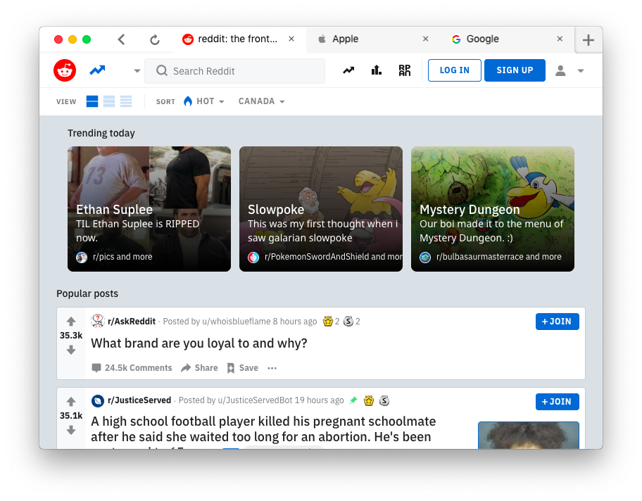

  

  <h1>Chameleon</h1>

Chameleon is a browser designed to provide you with a seamless browsing experience by blending in with whatever site you are visiting. Built on top of `Electron`, it aims to be fast, private, beautiful, and functional all at the same time.

# Features

- **AdBlock** - Browse the web without any ads or trackers. Due to the simplicity of Chameleon, websites load faster and consume less memory compared to modern browsers such as Chrome.
- **Beautiful and minimalistic UI** - The address bar is condensed into a single line to maximize the amount of content on the screen. Everything else, from the download manager to the settings to the history page is designed to do everything you expect, while remaining as simple as possible.
- **Cross-platform gestures** - Do you use Windows and wish you could navigate between pages with trackpad gestures like on Mac? Now you can!

# Screenshots

# [Roadmap](https://github.com/Polunom/chameleon/projects/1)

# Developing
* Install the latest version of [`Node.js`](https://nodejs.org/en/)
* Run `npm install` to install dependencies
* Start Chameleon by running `npm run start`
* Make your changes
* Press `cmd+shift+r` or `ctrl+shift+r` to restart the browser 

# Contributing

If you see any bugs with Chameleon or want to suggest a new feature, please feel free open an issue. Chameleon is an open-source project and is still in its early development stages - we have a lot of features planned and would appreciate any help we can get!
